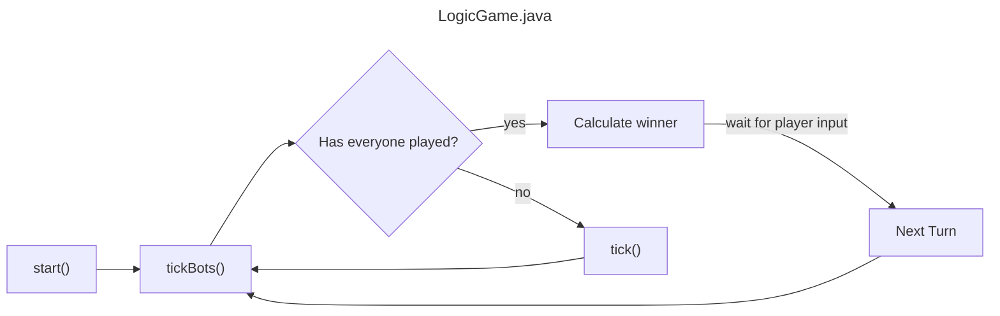

# Briscola
A Java implementation of the Italian card game Briscola written by [Mourad](https://github.com/Mourad261103) and [Starless](https://github.com/StarlessDev).

## How was it made 🧐
We have written a minimalistic api that enables everyone to build their own simple card game.
All the classes are located in the package [`us.teamronda.briscola.api`](src/main/java/us/teamronda/briscola/api) and are split into:
- interfaces: they hold the necessary methods and their respective javadocs
- abstract classes: they implement their respective interface and hold some code that is shared between different card games. For example the class `AbstractDeck` holds a list of cards and implements some methods to take out cards from the deck itself, which likely does not need any custom implementation from other developers.

For each object we provide the respective UML diagram (which also contains the representation of our api implementation): you can view them by clicking [here](uml/).
Now let's quickly get into the interfaces defined:

### [ICard](src/main/java/us/teamronda/briscola/api/cards/ICard.java)
This interface represents, as you might have guessed, a single playing card.
It holds two methods returning an Enum:
- ICard#getType: returns a [CardType](src/main/java/us/teamronda/briscola/api/cards/CardType.java) enum, which represents the number or figure on the card.
- ICard#getSeed: returns a (pretty self-explanatory) [Seed](src/main/java/us/teamronda/briscola/api/cards/Seed.java) enum
- ICard#getPoints: returns an integer and uses the Seed and CardType to calculate the worth of this card object

### [IDeck](src/main/java/us/teamronda/briscola/api/deck/IDeck.java)
This interface represents a Deck, aka a glorified collection of cards with all sorts of methods to interact with said collection.

Instead of directly implementing this interface, we advise to extend the abstract class [AbstractDeck](src/main/java/us/teamronda/briscola/api/deck/AbstractDeck.java) and to start working from there.
Want an example? Check out our [Deck](src/main/java/us/teamronda/briscola/objects/Deck.java) class.

### [IPlayer](src/main/java/us/teamronda/briscola/api/player/IPlayer.java)
This interface represents any Player participating in the game, being either a human or a bot. The object holds the integer representing the points of the player and a collection of cards representing the player's hand.
IPlayer also extends the [Comparable](https://docs.oracle.com/en%2Fjava%2Fjavase%2F21%2Fdocs%2Fapi%2F%2F/java.base/java/lang/Comparable.html) interface, so you need to implement the `compareTo()` to create a scoreboard at the end of the game.
Remember that all players are supposed to have **unique** usernames.

Instead of directly implementing this interface, we advise to extend the abstract class [AbstractPlayer](src/main/java/us/teamronda/briscola/api/player/AbstractPlayer.java) and to start working from there.
Want an example? Check out our [Player](src/main/java/us/teamronda/briscola/objects/Player.java) class.

### [GameLoop](src/main/java/us/teamronda/briscola/api/game/GameLoop.java)
This interface defines a few methods which define some functions that need to be called in various moments of the game. This is the heart of the project since most of the game logic will be implemented here.

As always we provide an abstract class [AbstractGameLoop](src/main/java/us/teamronda/briscola/api/game/AbstractGameLoop.java) with some methods already implemented, let's briefly see how does it work:
- All the players are stored in a list (why not a set? see the code for an explanation) and said players can be accessed calling the `getWhoIsPlaying()` method.
- The `getWhoIsPlaying()` method accesses a player in a certain index, defined as `playerIndex` in the code, which needs to be **manually** incremented to get to the next player (and **manually** reset to zero at the end of the game).
- The cards played in a turn by the players are stored in a `Map<String, ICard>`, which associates the player's (unique) username to the card they played.
- To execute a player's turn the method `tick()` needs to be called with the `IPlayer` and `ICard` (the card they played) as parameters. This method will differ from implementation to implementation.

Our game logic is located in the class [LogicGame](src/main/java/us/teamronda/briscola/LogicGame.java), check it out to see and example implementation of this interface.

## The Game Flow
This paragraph will explain what happens in the code of LogicGame.java during a standard turn.
Keep in mind that we tried to write the logic of the game for N players, even if our gui supports only two players.

Our idea is to make all the bots play until the first human player is found: that's exactly what the `tickBots()` method does (that just calls `tick()` for every bot).
This way we are 100% sure that the next player is human, and we have to wait for their input to continue. When we receive their input we call the `tick()` method, and then we call the `tickBots()` method again, since we do not know how many bots there are.

When everyone has played the program calculates who won and adds the points to the winner, and we wait for the human player to advance to the next turn. In our project this is done by clicking the "Next turn" button, but this could be automated with a task calling the `nextTurn()` method.

The flowchart of the method calls would roughly look something like this (JavaFX event calls not included):

## Issues
Obviously our api is not perfect and was made only for simple card games, not to be perfect in every aspect. Here's how could it be improved:
- We assign to each card a value, so games where cards are evaluated in groups (like poker for example) will not be implementable.
- We support only one type of cards, if someone wants to use a different one they will have to rewrite the CardType and Seed enums

## Other questions:
❓ How does the bot play?

💬 It just plays a random card. Implementing an algorithm for the bot is outside the scope of this project. If anyone wants to work on it, feel free to implement it yourself!

---

❓ Where did you get the cards' assets from?

💬 They are from [another repo](https://github.com/profumato4/Briscola), they implemented Briscola as well using Swing as the gui framework. Go check them out. (The repo is under MIT License).

---

❓ Why is your base backage `us.teamronda.briscola`?

💬 "Ronda" is a moroccan card game, so since we are a team of two people we thought of this package name. It just sounded cool.
