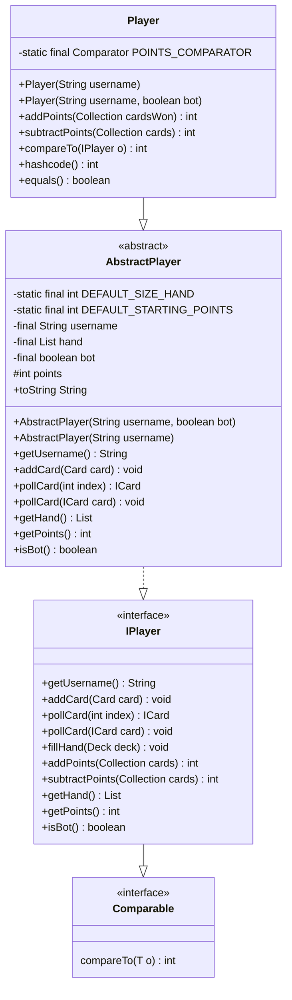

```mermaid
classDiagram
class Comparable {
    <<interface>>
    compareTo(T o) int
}

class IPlayer {
    <<interface>>

    +getUsername() String 
    +addCard(Card card) void
    +pollCard(int index) ICard
    +pollCard(ICard card) void
    +fillHand(Deck deck) void
    +addPoints(Collection<ICard> cards) int 
    +subtractPoints(Collection<ICard> cards) int
    +getHand() List<ICard>
    +getPoints() int
    +isBot() boolean
}
IPlayer --|> Comparable

class AbstractPlayer {
    <<abstract>>
    -static final int DEFAULT_SIZE_HAND
    -static final int DEFAULT_STARTING_POINTS

    +AbstractPlayer(String username, boolean bot)
    +AbstractPlayer(String username)

    -final String username
    -final List<ICard> hand
    -final boolean bot
    #int points

    +getUsername() String
    +addCard(Card card) void
    +pollCard(int index) ICard
    +pollCard(ICard card) void
    +getHand() List<ICard>
    +getPoints() int
    +isBot() boolean
    +toString String
}
AbstractPlayer ..|> IPlayer

class Player {
    -static final Comparator<Integer> POINTS_COMPARATOR

    +Player(String username)
    +Player(String username, boolean bot)

    +addPoints(Collection<ICard> cardsWon) int
    +subtractPoints(Collection<ICard> cards) int
    +compareTo(IPlayer o) int
    +hashcode() int
    +equals() boolean
}
Player --|> AbstractPlayer
```
